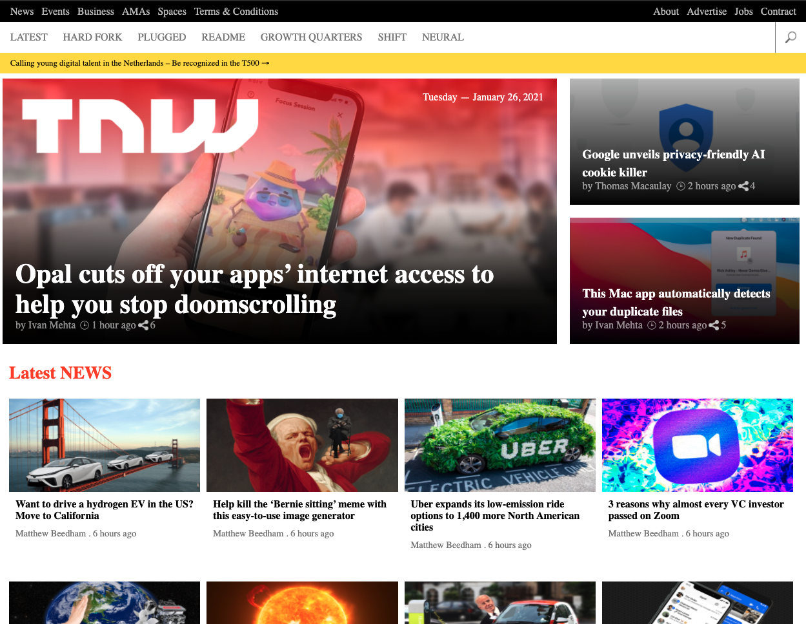

# TNW | PERMA clone (Responsive Design)

> The project is a clone of the PNW | PERMA website.

This page(in the project) is actually built in a responsive way.

## Built With

- HTML5 & CSS 3
- No Frameworks
- Some basic HTML tag with Float, Flex, Grid, Media Query

## Live Demo

[Live Demo Link](https://mahbubul14.github.io/tnw-perma/)

👤 **Mahbub Alam**

- GitHub: [@githubhandle](https://www.linkedin.com/in/mahbubul-alam-20595/)
- Twitter: [@twitterhandle](https://twitter.com/MahbubA10454419)
- LinkedIn: [LinkedIn](https://github.com/mahbubul14/)

## 👤 **Saman**

- GitHub: [@SamanAtashi](https://github.com/SamanAtashi)
- Twitter: [@AtashiSaman](https://twitter.com/AtashiSaman)
- LinkedIn: [@saman-atashi](https://www.linkedin.com/in/saman-atashi-9539911b0)

## 🤝 Contributing

Contributions, issues, and feature requests are welcome!

## Show your support

Give a ⭐️ if you like this project!

## Acknowledgments
